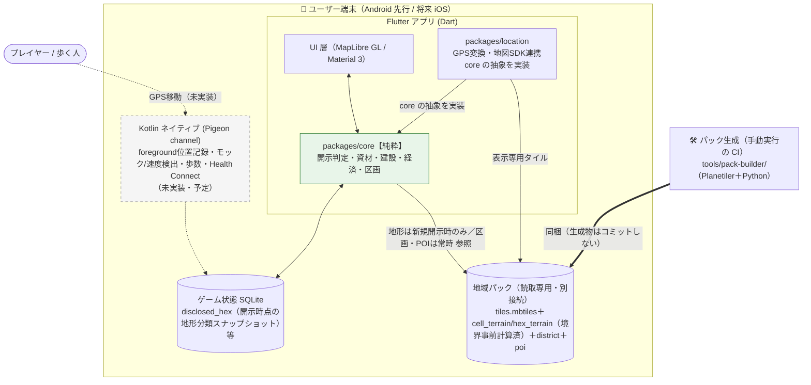

# terra-town

歩いた場所が開拓され、自分の街が育っていく GPS 位置情報ゲーム（Android 先行）。

## コンセプト

- GPS を用いてマップを歩く。**歩いた場所の霧が晴れて開拓される**
- 開拓エリアから資材を獲得し、実在地図の上に**自分の街を建設・育成**する
- **歩く楽しさ + 健康促進 + マップの開拓**を組み合わせる
- 行ったことがない場所も**ポイントで開拓**できる
- → 最終的に「**地球が自分の街になる**」楽しさを目指す

## ドキュメント

仕様書は本リポジトリ内で管理する（GitHub Spec Kit / 仕様書ファースト）。

| ドキュメント | 内容 |
|--------------|------|
| [docs/concept.md](docs/concept.md) | 初期コンセプトメモ（2026-07-08 起草、2026-07-20 コンセプト確定） |
| [specs/001-mvp/spec.md](specs/001-mvp/spec.md) | MVP 仕様（GDD 相当・何を/なぜ）。ゲート① 承認済み |
| [specs/001-mvp/plan.md](specs/001-mvp/plan.md) | MVP 実装計画（技術スタック・アーキ）。ゲート② 承認済み |
| [DESIGN.md](DESIGN.md) | UIデザイン仕様（Material 3 ＋ 独自トークン） |
| [docs/architecture.md](docs/architecture.md) | 環境構成図（Mermaid・詳細版） |
| [docs/opening_points.md](docs/opening_points.md) | 開放ポイント（未踏破エリアの開放手段）定義（Issue #4） |
| [docs/terrain.md](docs/terrain.md) | エリア（ヘクス）の形状・地形タイプ定義（2026-07-23、Issue #3） |
| [docs/landmark_objects.md](docs/landmark_objects.md) | 名所・固有オブジェクト（大量配置POI）システム定義（2026-07-26、Issue #6） |
| [docs/buildings.md](docs/buildings.md) | 建物・建設システムと人口メカニクス定義（2026-07-26、Issue #5） |

## アーキテクチャ / 構成図

MVP は **端末内完結（ステートフルなバックエンドなし）**。**外部との通信はゼロ**（対象1エリアの地域パックは**アプリに同梱**）で、**歩行位置はサーバに送信しない**。都道府県/市域単位に広げる拡張フェーズで初めて地域パックの静的ホスティングからの初回DL（任意）が発生するが、これは MVP には含まれない。詳細・依存方向図・拡張フェーズの構成図は [docs/architecture.md](docs/architecture.md)。

> 依存方向: `core/`（純粋ロジック）は `location/`（GPS・地図SDK・SQLite）を import しない一方向依存（[GPS_ARCHITECTURE 準拠](docs/architecture.md)）。拡張フェーズの地域パック配布（CDN）は MVP の構成要素ではない — 詳細は [docs/architecture.md](docs/architecture.md)。
