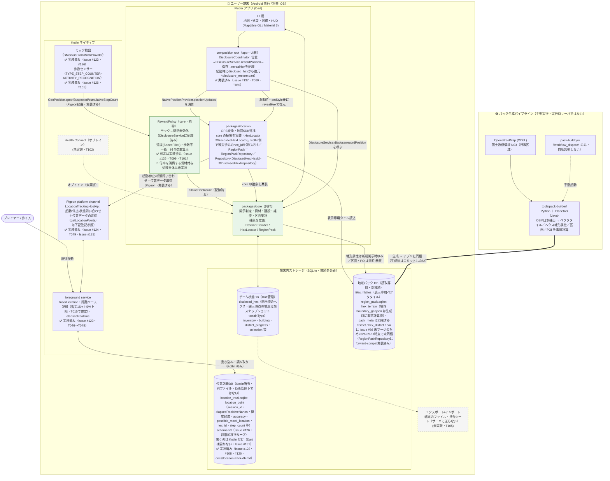
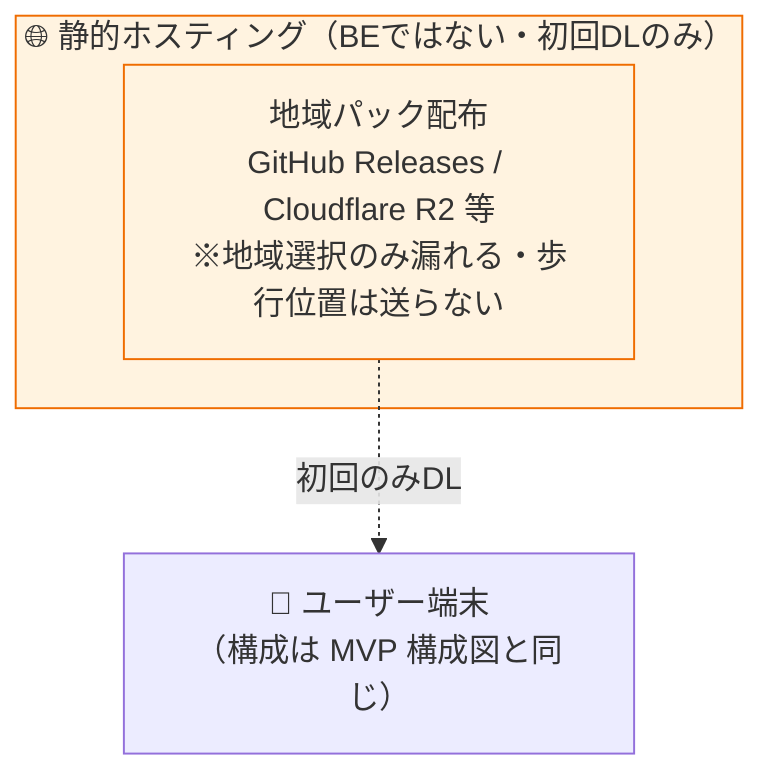

# terra-town 環境構成図（MVP / ゲート②）

> spec-kit plan 工程の環境構成図。MVP は **端末内完結（ステートフルなバックエンドなし）**。
> **MVP の外部通信はゼロ**（対象1エリアの地域パックは**アプリに同梱**・`plan.md` §3.3。通信ゼロ・規約リスクゼロ・プライバシー完全）。**歩行位置はサーバに送信しない。**
> 都道府県/市域単位に広げる**拡張フェーズ**（下記）で初めて地域パックの静的ホスティングからの初回DLが発生するが、これは MVP の構成要素ではない。
> 変更を伴う実装をしたら、コードと同じコミットで本図と README を更新する。
> 位置記録DB（`location_track.sqlite`）のスキーマ・受け渡し方法の詳細は [docs/location-track-db.md](location-track-db.md)（Issue #123・#124・#126）。

## MVP 構成（端末内完結・外部通信ゼロ）

**図の注記（実装済みの主要設計決定）**:

- **位置→開示判定→保存→霧の解除の配線は実装済み（Issue #137・2026-09-11・T060・T069）**: 以前は `RegionPack`（`RegionPackRepository`）・`Repository<DisclosedHex, HexId>`（`DisclosedHexRepository`）の実装、およびそれらを組み立てて `NativePositionProvider` → `DisclosureService` → 永続化 → `FogOfWarController.revealHex` へつなぐ composition root（上図の `wiring`）が存在しなかった。本 Issue で全て実装し、`app/lib/features/map/map_screen.dart` が地図画面の準備完了（`onFogLayerReady`）を起点に、(a) `disclosed_hex` から復元 → (b) 位置ストリームの購読開始、の順で配線する。
- **開示時点スナップショット方式（Issue #96）**: 開示済みヘクスの地形分類の正は `disclosed_hex.terrainType`（開示した瞬間の値をスナップショットとして保存）であり、**地域パックを再度引き直すことはない**。地域パック（`hex_terrain`）を参照するのは「新規開示の瞬間」だけである。**区画（`district`）・名所 POI はスナップショットの対象外**で、常に現行の地域パックから解決する（区画は現在の区画定義に対する制覇率として意味を持つため。POI は `collection` テーブルが発見記録を別途担保するため）。
- **fog of war は feature-state 方式（plan.md §8）**: 全ヘクスを起動時に1回だけ地図ソースへ追加し、開示は MapLibre の `feature-state` トグルで表現する。**地図側の feature-state は描画のための派生状態であり、開示状態の正ではない**（正は `disclosed_hex`）。`setStyle`（スタイル再読み込み）を呼ぶと feature-state は消えるため、その都度 `disclosed_hex` から再構築する。
- **ヘクス境界の事前計算（Issue #105）**: フォグ表示に使うヘクスの六角形境界（GeoJSON）は実行時に計算せず、パック生成時に `hex_terrain.boundary_geojson` として算出・格納済みのものを読み込む。
- **`maplibre_gl` は暫定的に git 依存**（上流の修正コミット固定。Android ビルドのブロッカー対応・plan.md §14 R1 追記）。Issue #92 で pub.dev 版 `^0.27.1` 以降が出次第、元の代表決定（Issue #55）に復帰する。
- **緯度経度 → H3 インデックス変換は Kotlin 側（`app/android/`・`H3HexIndexer`・`com.uber:h3` 4.5.0）で行う**（Issue #108・2026-09-11）。位置記録 foreground service が記録時点で `hex_id` を確定し `location_point` に保存、Pigeon 経由で Dart へ渡す。`packages/core` が定義する `HexLocator` 抽象の本番実装（`packages/location` の `RecordedHexLocator`）は `GeoPosition.hexId`（Kotlin側で確定済みの値）を返すだけで、変換ロジック自体は持たない。以前の暫定実装（Dart側・`h3_flutter`。Issue #107・#115）は撤去済み。
- **位置記録 foreground service は実装済み（Issue #123・2026-09-11・T046〜T048）**: fused location provider・距離ベースサンプリング（暫定値・T015で確定）・単調時計 `elapsedRealtime` で記録し、Kotlin 側所有の専用DB（`location_track.sqlite`）へ直接書き込む。**Drift 管理下のゲーム状態DB（`disclosed_hex` 等）には書き込まない**（スキーマの二重管理を避けるため。理由・スキーマ・受け渡し方法の詳細は `docs/location-track-db.md`）。
- **Pigeon platform channel・`NativePositionProvider` は実装済み（Issue #124・2026-09-11・T049・T050、Issue #131 で位置データの経路を変更）**。**`location_track.sqlite` を開くのは Kotlin だけ**であり、`NativePositionProvider`（`packages/location`）は Pigeon の host API（`pigeons/location_api.dart`・`LocationTrackingHostApi.getLocationPoints`）で Kotlin から位置データを受け取る（上図の `loc -> pigeon -> fg -> trackdb`）。Pigeon は起動・停止・状態問い合わせという制御面もあわせて運ぶ。⚠️ 当初（Issue #124）は Dart が `package:sqlite3` でこのファイルを読み取り専用で直接開いていたが、**同じアプリプロセス内で2つの SQLite（Kotlin 側は Android 標準、Dart 側は同梱版）が同じ WAL ファイルを扱うとロックの協調が成り立たず**（[sqlite.org「How To Corrupt An SQLite Database File」§2.2.1](https://www.sqlite.org/howtocorrupt.html)）、新しい位置が Dart に届かない不具合が実機で再現したため撤回した（Issue #131・2026-09-11 代表決定）。**同じ SQLite ファイルを Kotlin と Dart の両方から開いてはならない**（今後ファイルを追加する場合も同じ）。Pigeon の `StandardMessageCodec` はバイナリ形式で Kotlin の `Long` ⇔ Dart の `int`（64bit）をそのまま運ぶため、`elapsed_realtime_nanos` の 2^53 丸め（`docs/terrain.md` §4.4 は JSON 経路の話）は起きない。`GeoPosition`（`packages/core`）には本 Issue でプラットフォーム中立な `spoofSuspected`（既定 false）・`trackingSessionId`（既定 null）を追加し、`location_track.sqlite` の `possible_mock_location`・`session_id` 列をそのまま写す（判定ロジック自体は Issue #126）。
- **モック検出の無効化・歩数センサー突合（Issue #126・2026-09-11・T099・T101）は実装済み**。Kotlin側のモック検出自体（`isMock`/`isFromMockProvider`）はIssue #123で、歩数センサー（`TYPE_STEP_COUNTER`・`ACTIVITY_RECOGNITION`権限）はIssue #126で実装した。判定を1か所に集約する `RewardPolicy`（`packages/core/lib/src/antispoof/reward_policy.dart`）を新設し、`allowsDisclosure`（モックのみを見て開拓可否を判定）は `DisclosureService.recordPosition` に配線済み。`classify`（速度・歩数から区間ごとの資材付与倍率を算出）も実装済みだが、**その倍率を消費する資材付与処理そのものは未実装**（Issue #126 のスコープ外。将来の付与処理が実装される際に利用する）。
- **図中の点線ノード（Health Connect・エクスポート/インポート）は未実装**である（`specs/001-mvp/tasks.md` T102・T105）。実装が完了するまで実線には変更しない。

## 依存方向（GPS_ARCHITECTURE 準拠）

- `core/` は `location/`（GPS・地図SDK）を **import しない**。依存は `location/ → core/` の一方向。
- `core/`（`packages/core`）は Flutter・地図SDK・SQLite にも依存しない（`packages/core/pubspec.yaml` に drift/sqlite 系の依存なし）。SQLite への接続（ゲーム状態DB・地域パックDBの2接続）はすべて `packages/location/lib/src/db/` が担い、`core` はそれを介さず事前に渡された値・抽象（`PositionProvider` / `HexLocator` / `RegionPack`）のみを扱う。
- pubspec 依存で物理強制し、CI で import 方向を静的チェックする（`tools/check_import_direction.sh`）。

## 拡張フェーズ（多地域対応・MVP には含まれない）

> 対象1エリアのバーティカルスライス（本ページ冒頭の MVP 構成）を完成させたあと、都道府県/市域単位の複数パックへ広げる段階で導入する（`plan.md` §3.3）。**MVP の構成図（上記）にはこの節の要素は一切登場しない**。

- 拡張フェーズに移行して初めて、地域パックの初回ダウンロード（静的ファイル・任意）が発生する。**それでも歩行位置はサーバに送信しない**（静的ファイル配信は BE ではない・§「BEなし」の定義は plan.md §3.1）。
- ステートフルなバックエンドを持たない点は MVP と変わらない。ソーシャル機能導入（下記「将来」節・Issue #16）とは独立した軸であり、混同しない。

## 将来（#16 ソーシャル導入時に初めて BE）

- ランキング・フレンド街見学のため、ここで初めて**ステートフルなバックエンド**を導入する。
- 同時に GPS 偽装対策 ④（Play Integrity / サーバ照合）を有効化（対人不正の被害がここで発生するため）。
- 本図はその段階で更新する。
