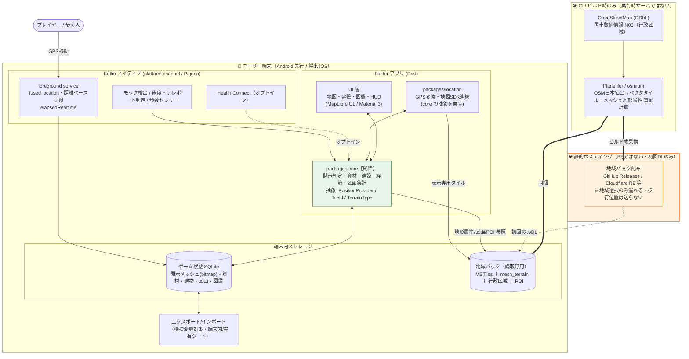
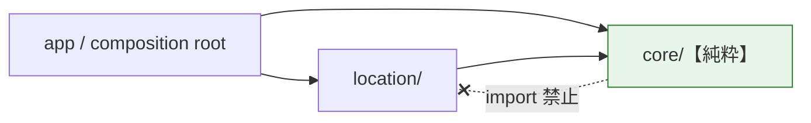

# terra-town 環境構成図（MVP / ゲート②）

> spec-kit plan 工程の環境構成図。MVP は **端末内完結（ステートフルなバックエンドなし）**。
> 外部との通信は「地域パックの初回ダウンロード（静的ファイル・任意）」のみで、**歩行位置はサーバに送信しない**。
> 変更を伴う実装をしたら、コードと同じコミットで本図と README を更新する。

## MVP 構成（端末内完結）

## 依存方向（GPS_ARCHITECTURE 準拠）

- `core/` は `location/`（GPS・地図SDK）を **import しない**。依存は `location/ → core/` の一方向。
- pubspec 依存で物理強制し、CI で import 方向を静的チェックする。

## 将来（#16 ソーシャル導入時に初めて BE）

- ランキング・フレンド街見学のため、ここで初めて**ステートフルなバックエンド**を導入する。
- 同時に GPS 偽装対策 ④（Play Integrity / サーバ照合）を有効化（対人不正の被害がここで発生するため）。
- 本図はその段階で更新する。
